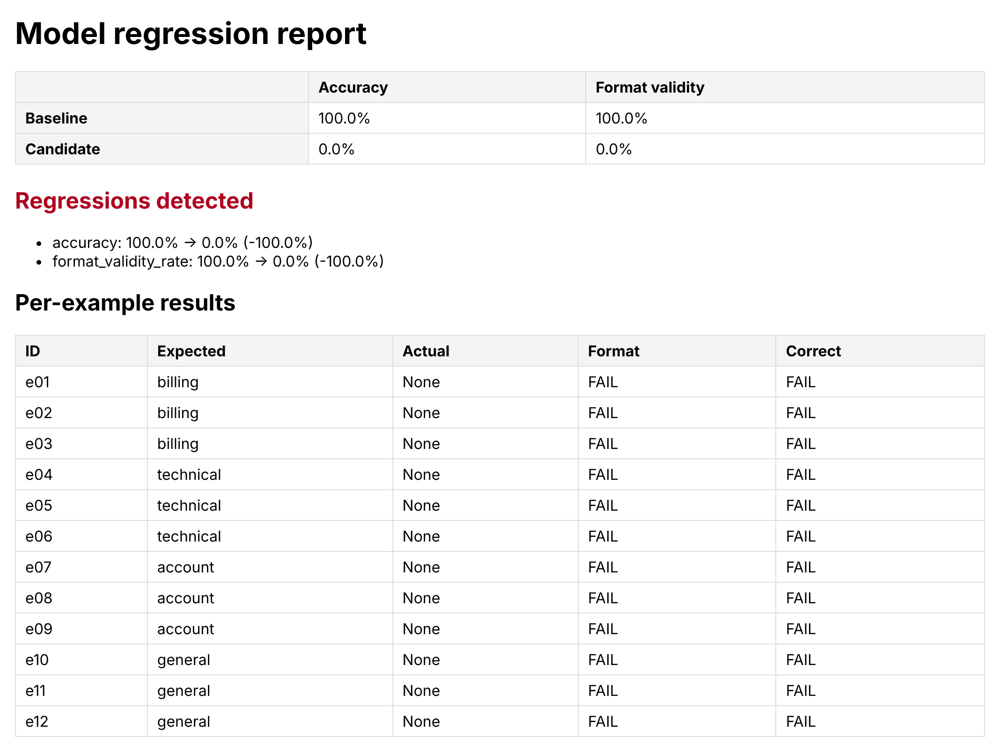

# Model Regression Detection System — Implementation & Testing Guide



*CI report for a PR that switched the default prompt to the trimmed `v2`: format validity on `gpt-4o-mini` fell from 100% to 0% under strict JSON parsing, and the check failed.*

A CI/CD-style pipeline that runs any LLM feature against a fixed "golden
dataset" whenever the prompt or model changes, scores it, compares the score
to a stored baseline, and fails the build (and pings Slack) if quality drops.

The scaffold ships with a working example feature (a support-email
classifier) so the whole loop — including a deliberately-injected regression
— runs offline with zero API cost, using a deterministic mock model. Swap in
the real OpenAI client once you trust the mechanics.

## What's in here

```
app/
  llm_client.py        Mock (keyword-based, offline) and OpenAI providers
  llm_feature.py        The feature under test: builds the prompt, calls the model
  prompts/v1.py          Versioned prompt — add v2.py etc. to test prompt changes
  eval/
    format_validator.py  Checks the model's JSON output against the schema
    metrics.py            Accuracy / format-validity aggregation
    regression.py          Compares candidate metrics + per-case results to baseline
    runner.py               Runs the feature against every golden example
  storage/db.py           SQLite: run history + which run is the baseline
  alerts/slack.py          Slack webhook (prints locally if no webhook is set)
  report/
    html_report.py         Static HTML baseline-vs-candidate report
    dashboard.py             Optional Streamlit dashboard over run history
data/golden_dataset.json    12 test cases across billing/technical/account/general
scripts/run_eval.py          CLI entrypoint — this is what CI calls
tests/                        Unit tests for every piece above (no network needed)
.github/workflows/           GitHub Actions job that runs on every PR
```

## 1. Install

```bash
python -m venv .venv && source .venv/bin/activate
pip install -r requirements.txt
```

## 2. Run the unit tests

These cover the format validator, metrics, regression-detection logic, and
the mock LLM feature — pure Python, no network or API key required.

```bash
pytest tests/ -v
```

## 3. Set a baseline

The very first run has nothing to compare against, so save it as the
baseline. The default mock model classifies by keyword and gets all 12 golden
cases right:

```bash
python scripts/run_eval.py --set-baseline
```

```
Ran 12 golden cases against prompt `v1` (mock)
  Accuracy:        100.0%
  Format validity: 100.0%
Run #1 saved and marked as the new baseline.
```

## 4. Prove it catches a regression

`--error-rate` deliberately corrupts a fraction of the mock model's answers
(wrong category or truncated JSON) so you can see the pipeline actually work,
without needing a second real model to break:

```bash
python scripts/run_eval.py --error-rate 0.3 --compare-baseline
echo "exit code: $?"
```

```
Ran 12 golden cases against prompt `v1` (mock, error_rate=0.3)
  Accuracy:        50.0%
  Format validity: 91.7%
Report written to reports/latest.html

2 metric regression(s), 6 example regression(s) detected.
[SlackNotifier] SLACK_WEBHOOK_URL not set - printing the alert instead:
:rotating_light: Regression detected - prompt `v1`, provider `mock` (run #2)
- accuracy: 100.0% -> 50.0% (-50.0%)
- format_validity_rate: 100.0% -> 91.7% (-8.3%)
- 6 test case(s) newly failing:
    e02: expected `billing`, was `billing`, now `technical`
    ...
exit code: 1
```

Exit code `1` is what makes `--compare-baseline` useful in CI — the GitHub
Actions job in `.github/workflows/regression-check.yml` fails the PR check on
that exit code. Open `reports/latest.html` in a browser to see the
baseline-vs-candidate table and per-case pass/fail.

Run it again without `--error-rate` and it correctly reports no regressions
(exit code `0`) — worth checking once so you trust it isn't just always
failing.

## 5. Test a real prompt change

`app/prompts/v2.py` ships as a worked example: a "trimmed to save tokens"
version of v1 that drops the few-shot examples and the explicit
`"Respond with ONLY a JSON object"` instruction - a very common real-world
prompt regression.

The mock model is otherwise blind to prompt wording (it classifies by
keyword, not by reading instructions), but it does watch for that one exact
instruction string: drop it, and the mock reproduces the failure real models
commonly make - adding a conversational preamble that breaks JSON parsing.
That's what makes comparing prompt *versions* meaningful offline instead of
always scoring identically. Run it after setting the v1 baseline in step 3:

```bash
python scripts/run_eval.py --prompt-version v2 --compare-baseline
```

```
Ran 12 golden cases against prompt `v2` (mock)
  Accuracy:        16.7%
  Format validity: 16.7%
...
2 metric regression(s), 10 example regression(s) detected.
exit code: 1
```

For your own prompt changes, edit `v1.py` directly, or copy it to `v3.py`
and register it in `app/prompts/__init__.py`. If a new prompt is at least as
good, promote it:

```bash
python scripts/run_eval.py --prompt-version v3 --set-baseline
```

## 6. Wire up Slack (optional)

Create an [incoming webhook](https://api.slack.com/messaging/webhooks) for a
channel, then:

```bash
cp .env.example .env
# edit .env: SLACK_WEBHOOK_URL=https://hooks.slack.com/services/...
python scripts/run_eval.py --error-rate 0.3 --compare-baseline
```

Without a webhook set, alerts just print to the console — useful for local
testing, which is why it's the default.

## 7. Switch to the real model

```bash
# in .env
LLM_PROVIDER=openai
OPENAI_API_KEY=sk-...
```

Re-run step 3 and 4 for real: set a baseline against the actual model, then
edit `app/prompts/v1.py` to make it deliberately worse and confirm the
pipeline still catches it — that's the real test of the whole system.

## 8. Wire up CI

`.github/workflows/regression-check.yml` runs on every PR that touches
`app/**`, `scripts/**`, the golden dataset or `requirements.txt`. Add two repo
secrets: `OPENAI_API_KEY` and `SLACK_WEBHOOK_URL`.

`runs.db` is not committed, so CI builds its own baseline each time: it checks
out the PR's target branch next to the PR, scores the target branch with
`--set-baseline`, then scores the PR with `--compare-baseline`. That costs two
eval runs per PR but means the baseline can never be stale. If no baseline
exists, `--compare-baseline` exits with code 2 rather than passing, so a green
check always means a real comparison happened. The HTML report is uploaded as
a build artifact.

## 9. Optional: the dashboard

```bash
pip install -r requirements-dashboard.txt
streamlit run app/report/dashboard.py
```

Shows accuracy/format-validity over time across every saved run, plus the
latest run's per-example breakdown.

## Tuning notes

- **`REGRESSION_TOLERANCE`** (default `0.02`, i.e. 2 points): how much a
  metric can drop before it counts as a regression. Too tight and normal
  model-provider variance trips false alarms; too loose and real regressions
  slip through. Start at 0.02–0.05 and adjust based on how noisy your golden
  dataset turns out to be in practice.
- **Golden dataset size**: 12 cases is enough to prove the mechanism works.
  For a real feature, aim for 50–200 cases that actually cover edge cases
  your team has been burned by before — that history *is* the dataset.
- **The "tool use" metric** from the original spec isn't implemented here
  because the example feature (classification) doesn't call tools. The seam
  to add it is `app/eval/format_validator.py` — if your real feature makes
  tool calls, validate the tool name/arguments there the same way category
  and summary are validated now, and add the result to `metrics.py`.
